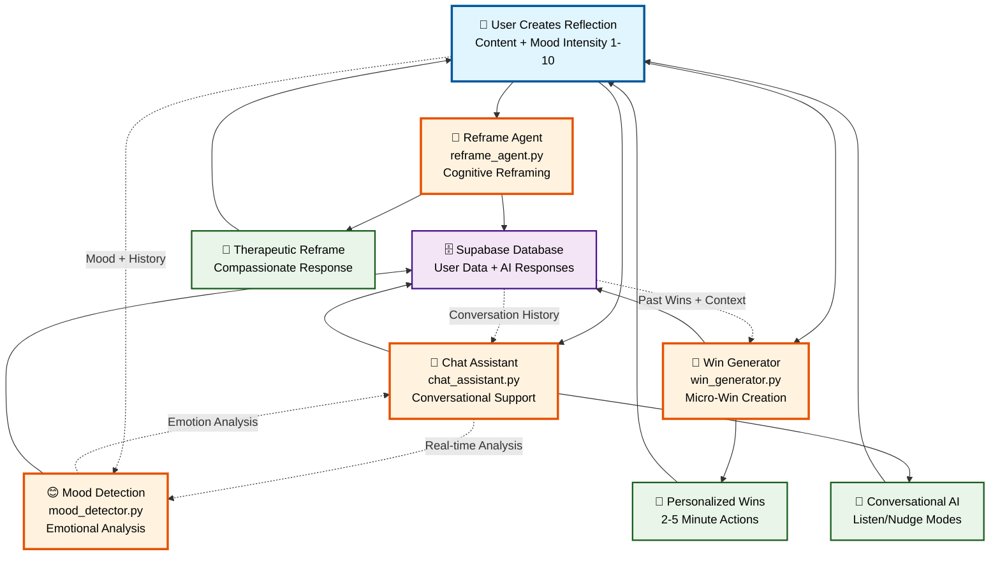

```mermaid
graph TB
    %% User Input
    User[👤 User Creates Reflection<br/>Content + Mood Intensity 1-10]
    
    %% Core AI Agents
    ReframeAgent[🔄 Reframe Agent<br/>reframe_agent.py<br/>Cognitive Reframing]
    WinAgent[🎯 Win Generator<br/>win_generator.py<br/>Micro-Win Creation]
    ChatAgent[💬 Chat Assistant<br/>chat_assistant.py<br/>Conversational Support]
    MoodAgent[😊 Mood Detection<br/>mood_detector.py<br/>Emotional Analysis]
    
    
    %% Database
    Database[🗄️ Supabase Database<br/>User Data + AI Responses]
    
    %% User Outcomes
    ReframeResponse[📝 Therapeutic Reframe<br/>Compassionate Response]
    WinSuggestions[🎯 Personalized Wins<br/>2-5 Minute Actions]
    ChatResponse[💬 Conversational AI<br/>Listen/Nudge Modes]
    
    %% Primary Flow
    User --> ReframeAgent
    User --> WinAgent
    User --> ChatAgent
    
    %% Agent Dependencies
    ChatAgent -.->|Real-time Analysis| MoodAgent
    
    
    %% Context Sharing
    User -.->|Mood + History| MoodAgent
    MoodAgent -.->|Emotion Analysis| ChatAgent
    Database -.->|Past Wins + Context| WinAgent
    Database -.->|Conversation History| ChatAgent
    
    %% Outputs
    ReframeAgent --> ReframeResponse
    WinAgent --> WinSuggestions
    ChatAgent --> ChatResponse
    
    %% Data Persistence
    ReframeAgent --> Database
    WinAgent --> Database
    ChatAgent --> Database
    MoodAgent --> Database
    
    %% Final User Experience
    ReframeResponse --> User
    WinSuggestions --> User
    ChatResponse --> User
    
    %% Styling
    classDef userClass fill:#e1f5fe,stroke:#01579b,stroke-width:3px,color:#000000
    classDef agentClass fill:#fff3e0,stroke:#e65100,stroke-width:3px,color:#000000
    classDef outputClass fill:#e8f5e8,stroke:#1b5e20,stroke-width:2px,color:#000000
    classDef dbClass fill:#f3e5f5,stroke:#4a148c,stroke-width:2px,color:#000000
    
    class User userClass
    class ReframeAgent,WinAgent,ChatAgent,MoodAgent agentClass
    class ReframeResponse,WinSuggestions,ChatResponse outputClass
    class Database dbClass
```